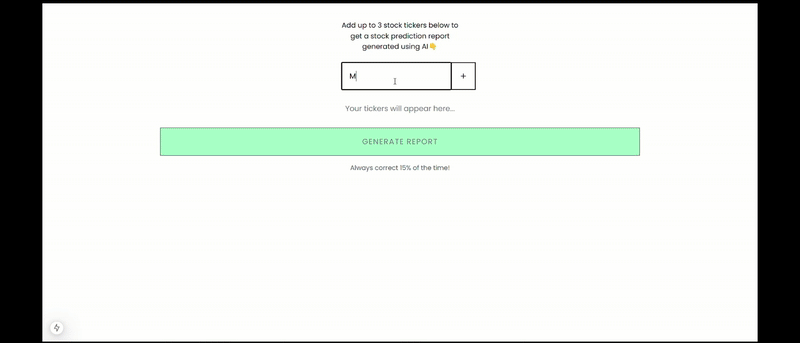

# AI Stock Report Generator

An intelligent stock analysis tool that generates comprehensive reports on stock performance using real-time market data and AI insights.

## Demo



Watch the demo above to see the application in action:

- Adding multiple stock tickers
- Fetching real-time market data
- Generating AI-powered analysis reports
- Responsive UI interactions

## Features

- **Real-Time Stock Data**: Fetch current and historical stock data using the Polygon.io API
- **Multiple Stock Analysis**: Analyze up to 3 different stocks simultaneously
- **AI-Powered Reports**: Generate detailed stock performance reports using OpenAI's GPT-4
- **30-Day Analysis**: Track stock performance over the last 30 days
- **Modern UI**: Built with Next.js 14 and styled with Tailwind CSS
- **Responsive Design**: Works seamlessly on both desktop and mobile devices

## Prerequisites

Before running this application, make sure you have:

- Node.js 18.0 or later
- npm or yarn package manager
- API keys for:
  - [OpenAI](https://platform.openai.com) - For AI-powered report generation
  - [Polygon.io](https://polygon.io) - For stock market data

## Environment Setup

1. Clone the repository
2. Create a `.env` file in the root directory with the following variables:

```bash
OPENAI_API_KEY=your_openai_api_key_here
POLYGON_API_KEY=your_polygon_api_key_here
```

## Installation

```bash
# Install dependencies
npm install
# or
yarn install

# Run the development server
npm run dev
# or
yarn dev
```

Open [http://localhost:3000](http://localhost:3000) with your browser to see the application.

## Usage

1. Enter a stock ticker symbol (e.g., AAPL, GOOGL) in the input field
2. Add up to 3 different stocks for analysis
3. Click "Generate Report" to get an AI-powered analysis of the selected stocks
4. View the comprehensive report including price changes and recommendations

## Security Notes

- Never commit your `.env` file to version control
- Keep your API keys secure and rotate them regularly
- Use environment variables for all sensitive information

## Tech Stack

- [Next.js 14](https://nextjs.org/) - React Framework
- [Tailwind CSS](https://tailwindcss.com/) - Styling
- [OpenAI API](https://openai.com/) - AI Report Generation
- [Polygon.io](https://polygon.io/) - Stock Market Data
- TypeScript - Type Safety
- React - UI Components

## Contributing

Contributions are welcome! Please feel free to submit a Pull Request.

## License

This project is licensed under the MIT License - see the LICENSE file for details.
